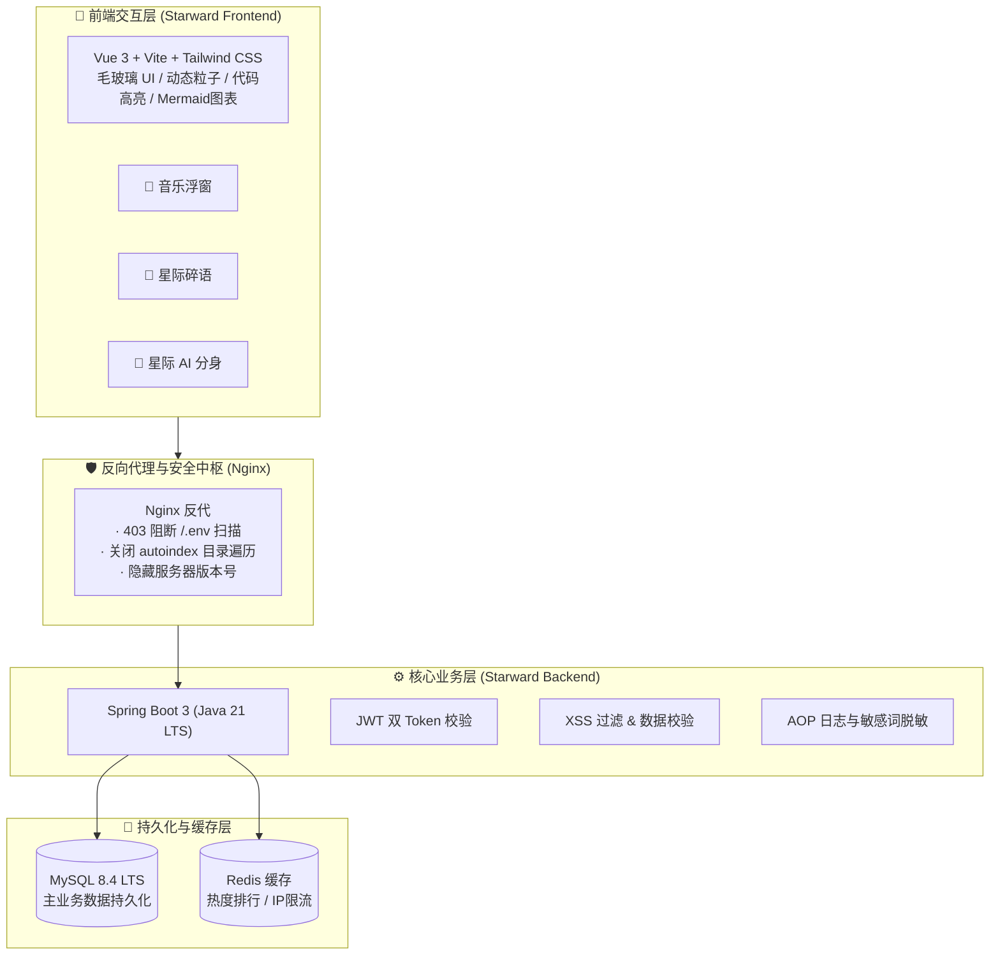

# 🌌 Starward Space (星向空间)

<p align="center">
  <strong>个人数字空间 · 知识沉淀池 · 全栈 AI 智能体试验田</strong>
</p>

<p align="center">
  
  
  
  
  
</p>

---

## 🧭 项目初心

> *并不是为了向世界证明什么，而是在嘈杂的信息洪流与内卷浪潮里，亲手为自己搭建一个有温度、有审美的赛博自留地。*

**Starward Space（星向空间）** 是一套采用前后端分离与工业级安全标准自研的个人全栈数字空间。它融合了**极客毛玻璃美学（Glassmorphism）**、**企业级高可用后端架构**以及**前沿 AI 智能体（Agent）常驻分身**。

---

## ✨ 核心亮点

- 🌌 **极客星空美学**：沉浸式毛玻璃拟态、流萤/粒子交互、深空暗夜自适应主题。
- 🛡️ **工业级安全防线**：
  - 环境变量机密脱敏隔离，开源代码零密码泄露；
  - 深度反向代理防御，严禁目录遍历探测，封锁 `/.env` 隐秘扫描；
  - MyBatis 参数化预编译防 SQL 注入，DOMPurify 标签净化防 XSS 攻击。
- 🚀 **扎实后端底盘**：
  - Spring Boot 3 + Java 21 LTS 黄金技术栈；
  - RESTful API 规范驱动，全局统一结果集 `Result<T>` 与异常兜底拦截；
  - Redis 缓存抗读，高性能文章热度榜单与 IP 访问频控。
- 🤖 **星际 AI 数字分身 (In Progress)**：
  - 挂载基于 LangGraph / RAG 知识库的专属个人智能体；
  - 访客可实时与你的 AI 分身对话，探索学术经历与技术文章。

---

## 🏛️ 系统架构



---

## 📁 目录结构 (Monorepo)

```text
starward-space/
├── starward-backend/     # 后端服务：Spring Boot 3 + Maven
├── starward-frontend/    # 前端交互：Vue 3 + Vite + Tailwind CSS
├── deploy/               # 生产部署：Nginx 配置、Docker Compose、安全脚本
├── docs/                 # 架构设计、数据库建表 SQL、API 接口文档
├── .gitignore            # 全局机密脱敏安全规则
├── LICENSE               # Apache 2.0 开源协议
└── README.md             # 项目主页与说明
```

---

## 📜 开源协议

本项目基于 [Apache License 2.0](LICENSE) 协议开源。欢迎学习交流，欢迎 Star 🌟！
